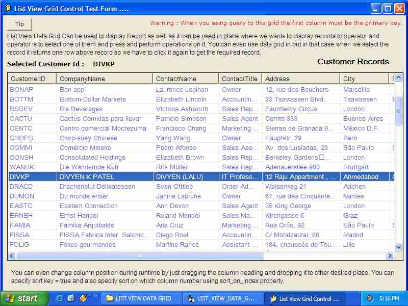



## Auto Select List View Grid Control

### Description

This control can be placed in case when we wants to give some sort of selection to the operator and operator has to select one of it and have to perform task. Due to auto selection it’s easy for operator to use than the data grid which does not support auto selection.

Please Vote me. If you like this.
 
### More Info
 
Connection String Of Database , Query to fetch records

First Column in query must be primary key , it is used as key.

Data in List View Grid

             |
---                |---
**Submitted On**   |2002-09-11 17:17:28
**By**             |[Divyen Patel](https://github.com/Planet-Source-Code/PSCIndex/blob/master/ByAuthor/divyen-patel.md)
**Level**          |Intermediate
**User Rating**    |4.7 (71 globes from 15 users)
**Compatibility**  |VB 6\.0
**Category**       |[Custom Controls/ Forms/  Menus](https://github.com/Planet-Source-Code/PSCIndex/blob/master/ByCategory/custom-controls-forms-menus__1-4.md)
**World**          |[Visual Basic](https://github.com/Planet-Source-Code/PSCIndex/blob/master/ByWorld/visual-basic.md)
**Archive File**   |[Auto\_Selec1299709112002\.zip](https://github.com/Planet-Source-Code/divyen-patel-auto-select-list-view-grid-control__1-38895/archive/master.zip)

